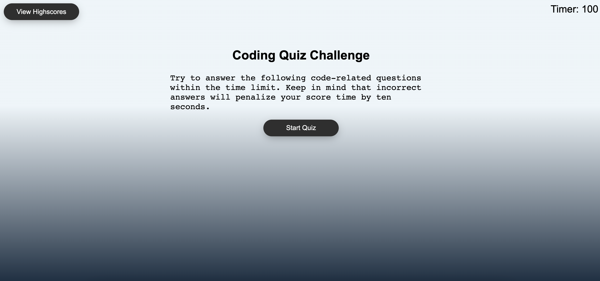
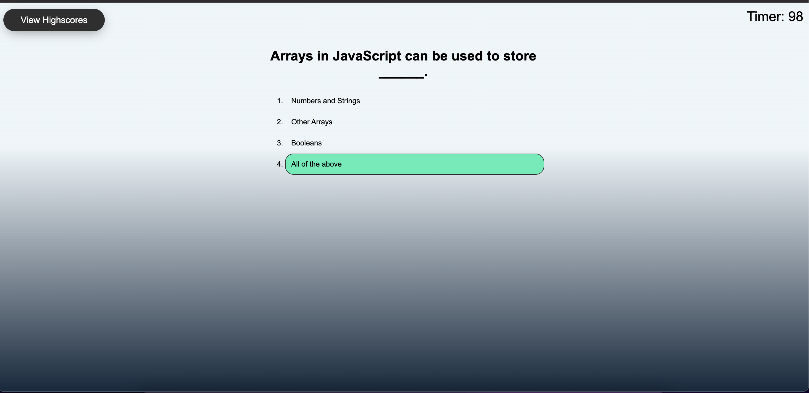
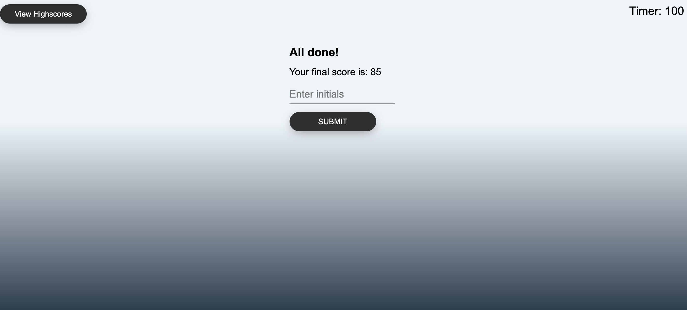
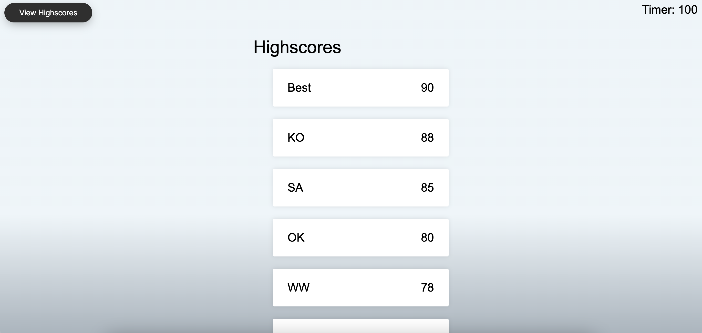

# code-quiz
## The Game:

### Demo: 

Link to the deployed application: https://ozerkerr.github.io/code-quiz/

---------
## Main page
When user lands on website, main page is displayed to them. Main page contains: 

* Name of the game
* Paragraph with description and rules
* Start button
* View high socres button

The user can start game by clicking "Start Quiz" button.

----------------
## Questionnaire

When user starts the game they are promted with question related to coding.

The user can select answer by clicking on any of the answer.
* If user has selected a correct answer then button turn green to indicate that answer was correct,
* if user has selected a wrong answer then button turn red to indicate that answer was incorrect.

----------------
## Quiz finish
When user answer to all of the question within timeframe than he is promted with form to add their initals in order to get leaderboard. 

_____________
## Leaderboard
When user has entered an initials and clicked on submit button, the leaderboad then displayed.

